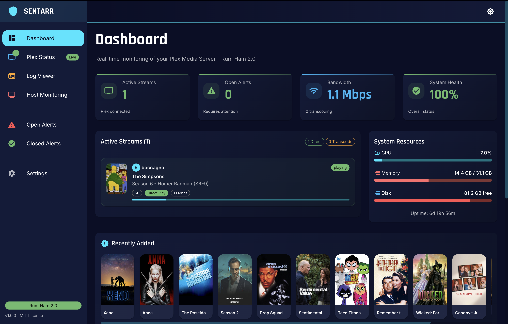
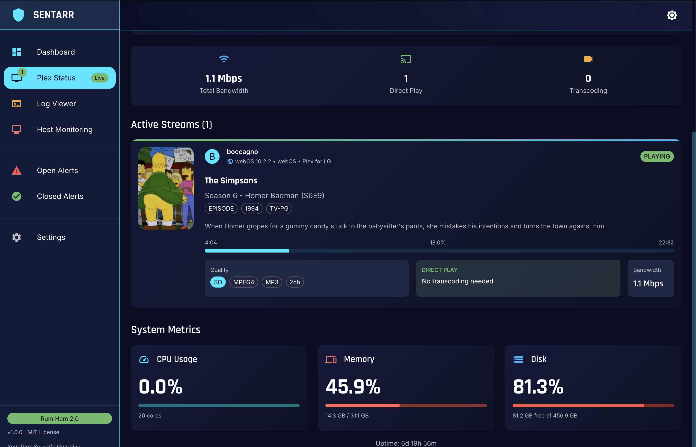
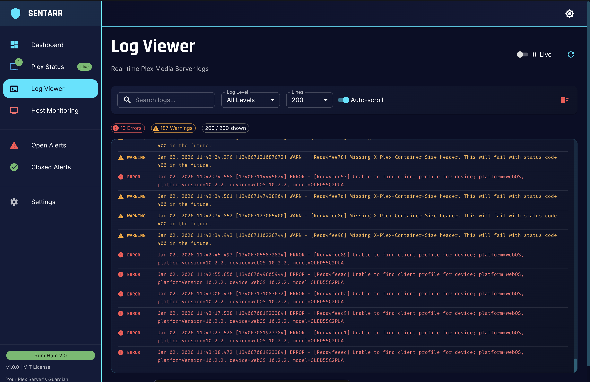
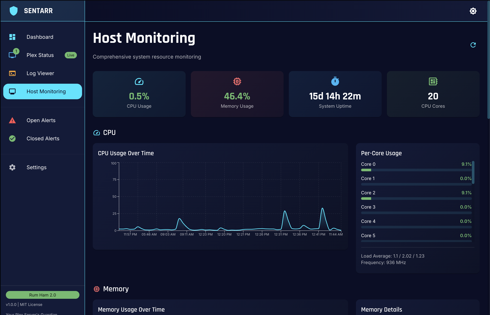

<div align="center">

```
   ____            _                  
  / ___|  ___ _ __| |_ __ _ _ __ _ __ 
  \___ \ / _ \ '_ \ __/ _` | '__| '__|
   ___) |  __/ | | | || (_| | |  | |  
  |____/ \___|_| |_|\__\__,_|_|  |_|  
```

# Sentarr

**Your Plex Server's Guardian** 🛡️

[](https://hub.docker.com/r/joshdev8/sentarr)
[](https://hub.docker.com/r/joshdev8/sentarr)
[](https://github.com/joshdev8/sentarr)
[](https://github.com/joshdev8/sentarr/blob/main/LICENSE)
[](https://github.com/joshdev8/sentarr/releases)

**Like Radarr for movies and Sonarr for TV shows, Sentarr stands watch over your Plex Media Server, alerting you to issues before they impact your users.**

[Features](#-features) • [Quick Start](#-quick-start) • [Screenshots](#-screenshots) • [Documentation](#-documentation) • [Support](#-support)

</div>

---

## 📸 Screenshots

<div align="center">

### Dashboard


*Real-time monitoring with active streams, system resources, and alert timeline*

### Plex Status


*Live Plex server information with library counts and active streams*

### Live Log Viewer


*Real-time Plex log monitoring with filtering and search*

### Live Host Monitoring


*Real-time Plex host resource monitoring*

</div>

---

## Features

### Comprehensive Monitoring
- **Real-time Log Analysis** - Tails Plex logs and detects issues instantly
- **Plex API Integration** - Direct connection to your Plex server for enhanced monitoring
- **Active Stream Tracking** - Monitor who's watching what in real-time
- **Smart Pattern Detection** - Identifies specific error types:
  - Stream/Playback errors
  - Database errors
  - Network connectivity issues
  - Authentication problems
  - Scanner/Metadata issues
  - Disk I/O errors
  - Transcoding failures

### Beautiful Web Dashboard
- **Modern React UI** - Built with TypeScript, Vite, and Material-UI
- **Real-time Updates** - Live data refresh every 5 seconds
- **Mobile Responsive** - Works perfectly on phones and tablets
- **Dark Theme** - Easy on the eyes for 24/7 monitoring
- **Interactive Charts** - Visualize error trends and system health

### Multi-Channel Alerts
- **Email (SMTP)** - Traditional email notifications
- **Discord** - Webhook integration with rich embeds
- **Slack** - Team notifications with customizable formatting
- **Custom Webhooks** - Home Assistant, ntfy, Gotify, or any webhook-compatible service
- **Smart Throttling** - Configurable cooldown to prevent alert spam
- **Threshold-based** - Only alert when error count exceeds your threshold

### Easy Deployment
- **Single Container** - Everything in one Docker container (like other *arr apps)
- **Minimal Resources** - Uses ~256-512MB RAM, <5% CPU
- **Works with Portainer** - One-click deployment
- **Auto-restart** - Resilient and self-healing
- **No Database** - Simple configuration via environment variables

---

## Quick Start

### Using Docker Compose (Recommended)

1. **Create `docker-compose.yml`:**

```yaml
version: '3.8'

services:
  sentarr:
    image: joshdev8/sentarr:latest
    container_name: sentarr
    restart: unless-stopped
    
    ports:
      - "6500:6500"
    
    volumes:
      # Update this path to your Plex logs
      - /opt/plex/config/Library/Application Support/Plex Media Server/Logs:/logs:ro
    
    environment:
      # Plex API (Recommended)
      - PLEX_API_ENABLED=true
      - PLEX_URL=http://plex:32400
      - PLEX_TOKEN=your-plex-token-here
      
      # Log Monitoring
      - PLEX_LOG_PATH=/logs
      - MONITOR_ERRORS=true
      - ERROR_THRESHOLD=5
      
      # Discord Notifications
      - DISCORD_ENABLED=true
      - DISCORD_WEBHOOK_URL=https://discord.com/api/webhooks/YOUR_URL
    
    networks:
      - plex  # Connect to your Plex network

networks:
  plex:
    external: true
```

2. **Start Sentarr:**

```bash
docker-compose up -d
```

3. **Access Dashboard:**

```
http://localhost:6500
```

### Using Docker Run

```bash
docker run -d \
  --name=sentarr \
  --restart=unless-stopped \
  -p 6500:6500 \
  -v /path/to/plex/logs:/logs:ro \
  -e PLEX_API_ENABLED=true \
  -e PLEX_URL=http://plex:32400 \
  -e PLEX_TOKEN=your-token \
  -e DISCORD_ENABLED=true \
  -e DISCORD_WEBHOOK_URL=https://... \
  joshdev8/sentarr:latest
```

### Using Portainer

1. **Stacks** → **Add Stack**
2. **Paste** docker-compose.yml
3. **Deploy**
4. **Done!**

---

## Configuration

### Required Settings

| Variable | Description | Example |
|----------|-------------|---------|
| `PLEX_LOG_PATH` | Path to Plex logs | `/logs` |
| `PLEX_URL` | Your Plex server URL | `http://plex:32400` |
| `PLEX_TOKEN` | Plex API token | Get from [here](https://support.plex.tv/articles/204059436) |

### Optional Settings

| Variable | Default | Description |
|----------|---------|-------------|
| `ERROR_THRESHOLD` | `5` | Errors before alerting |
| `TIME_WINDOW_MINUTES` | `5` | Time window to count errors |
| `ALERT_COOLDOWN_MINUTES` | `15` | Cooldown between alerts |
| `MONITOR_WARNINGS` | `true` | Monitor warning-level logs |

### Notification Channels

<details>
<summary><b>Discord</b></summary>

```yaml
- DISCORD_ENABLED=true
- DISCORD_WEBHOOK_URL=https://discord.com/api/webhooks/YOUR_WEBHOOK_URL
```

Create webhook: Server Settings → Integrations → Webhooks
</details>

<details>
<summary><b>Email (SMTP)</b></summary>

```yaml
- EMAIL_ENABLED=true
- SMTP_SERVER=smtp.gmail.com
- SMTP_PORT=587
- SMTP_USER=your-email@gmail.com
- SMTP_PASSWORD=your-app-password
- EMAIL_TO=admin@yourdomain.com
```
</details>

<details>
<summary><b>Slack</b></summary>

```yaml
- SLACK_ENABLED=true
- SLACK_WEBHOOK_URL=https://hooks.slack.com/services/YOUR_WEBHOOK_URL
```
</details>

<details>
<summary><b>Home Assistant</b></summary>

```yaml
- WEBHOOK_ENABLED=true
- CUSTOM_WEBHOOK_URL=http://homeassistant.local:8123/api/webhook/plex_alert
```

See [PLEX_API_SETUP.md](PLEX_API_SETUP.md) for Home Assistant automation examples.
</details>

---

## Documentation

- **[Plex API Setup](PLEX_API_SETUP.md)** - How to get your Plex token and configure API
- **[Docker Compose Examples](DOCKER_COMPOSE_EXAMPLES.md)** - Various deployment scenarios
- **[Vite Migration Guide](VITE_MIGRATION.md)** - Modern React setup details

---

## Architecture

```
┌─────────────────────────────────────────┐
│         Sentarr Container               │
│                                         │
│  ┌──────────┐  ┌──────────┐  ┌────────┐│
│  │  Nginx   │  │ Flask    │  │Monitor ││
│  │  :6500   │→ │ API      │→ │Service ││
│  │          │  │ :5000    │  │        ││
│  └──────────┘  └──────────┘  └────────┘│
│       ↓              ↓            ↓     │
│  React Dashboard   API      Log Parser │
└─────────────────────────────────────────┘
              ↓            ↓
         Plex API    Plex Logs
```

**Single container includes:**
- React/TypeScript frontend (Vite)
- Flask REST API
- Python log monitoring service
- Nginx web server
- Supervisor process manager

---

## Use Cases

### Home Media Server
Monitor your personal Plex server and get alerted when:
- Streams fail to start
- Transcoding errors occur
- Database issues arise
- Scanner fails to process new media

### Shared Plex Server
Keep tabs on multiple users streaming:
- See who's watching what in real-time
- Track transcoding load
- Monitor bandwidth usage
- Get notified of playback issues

### Plex with Friends/Family
Proactive support for your users:
- Fix issues before users complain
- Monitor server health 24/7
- Track library scanning problems
- Detect authentication issues early

---

## Comparison with Tautulli

| Feature | Sentarr | Tautulli |
|---------|---------|----------|
| Real-time Log Monitoring | ✅ | ❌ |
| Plex API Integration | ✅ | ✅ |
| Detects Backend Errors | ✅ | ⚠️ Limited |
| Modern React UI | ✅ | ❌ |
| Database Required | ❌ | ✅ |
| Resource Usage | ~256MB | ~512MB+ |
| Alert Throttling | ✅ | ⚠️ Basic |
| Single Container | ✅ | ✅ |

**TL;DR:** Sentarr catches errors Tautulli misses by monitoring logs directly, not just API events.

---

## Contributing

Contributions are welcome! Here's how:

1. **Fork** the repository
2. **Create** a feature branch: `git checkout -b feature/amazing-feature`
3. **Commit** your changes: `git commit -m 'Add amazing feature'`
4. **Push** to the branch: `git push origin feature/amazing-feature`
5. **Open** a Pull Request

### Development Setup

```bash
# Clone repo
git clone https://github.com/joshdev8/sentarr.git
cd sentarr

# Backend development
cd api
pip install flask flask-cors requests plexapi
python server.py

# Frontend development
cd frontend
npm install
npm run dev
```

---

## Stats

- **Single Container** - Like other *arr apps
- **Minimal Resources** - 256-512MB RAM, <5% CPU
- **Fast** - Vite-powered frontend builds in seconds
- **Secure** - No deprecated dependencies, actively maintained
- **TypeScript** - Fully typed frontend for reliability

---

## Tips & Tricks

### Finding Your Plex Log Path

**Docker Plex:**
```bash
docker inspect plex | grep -A 5 Mounts
```

**Common paths:**
- Docker: `/opt/plex/config/Library/Application Support/Plex Media Server/Logs`
- Unraid: `/mnt/user/appdata/plex/Library/Application Support/Plex Media Server/Logs`
- Synology: `/volume1/docker/plex/Library/Application Support/Plex Media Server/Logs`

### Getting Your Plex Token

**Quick method:**
1. Open Plex Web App
2. Play any media
3. Click ⋯ → "Get Info" → "View XML"
4. Look for `X-Plex-Token` in the URL

**Full guide:** [PLEX_API_SETUP.md](PLEX_API_SETUP.md)

### Connecting to Plex Network

```bash
# Find your Plex network
docker network ls | grep plex

# Add to docker-compose.yml
networks:
  plex:
    external: true
```

---

## Troubleshooting

<details>
<summary><b>Dashboard won't load</b></summary>

```bash
# Check container is running
docker ps | grep sentarr

# Check logs
docker logs sentarr

# Restart
docker restart sentarr
```
</details>

<details>
<summary><b>Can't connect to Plex API</b></summary>

1. Verify token is correct
2. Check Plex URL (usually `http://plex:32400`)
3. Ensure containers are on same network
4. Test: `docker exec sentarr curl http://plex:32400/identity`
</details>

<details>
<summary><b>No alerts appearing</b></summary>

1. Check log path is correct: `docker exec sentarr ls /logs`
2. Verify at least one notification channel is enabled
3. Check error threshold settings
4. Look at Settings page in dashboard
</details>

---

## License

This project is licensed under the **MIT License** - see the [LICENSE](LICENSE) file for details.

---

## Acknowledgments

- Inspired by the amazing **[*arr ecosystem](https://wiki.servarr.com/)** (Radarr, Sonarr, etc.)
- Built with **[React](https://react.dev/)**, **[Material-UI](https://mui.com/)**, and **[Flask](https://flask.palletsprojects.com/)**
- Special thanks to the **Plex** community

---

## Links

- **GitHub:** [github.com/joshdev8/sentarr](https://github.com/joshdev8/sentarr)
- **Docker Hub:** [hub.docker.com/r/joshdev8/sentarr](https://hub.docker.com/r/joshdev8/sentarr)
- **Issues:** [github.com/joshdev8/sentarr/issues](https://github.com/joshdev8/sentarr/issues)
- **Discussions:** [github.com/joshdev8/sentarr/discussions](https://github.com/joshdev8/sentarr/discussions)

---

<div align="center">

**Made with ❤️ for the Plex community**

If you find this useful, please ⭐ star the repo!

[Report Bug](https://github.com/joshdev8/sentarr/issues) • [Request Feature](https://github.com/joshdev8/sentarr/discussions)

</div>